# Remote serial in Lorris for ESP32
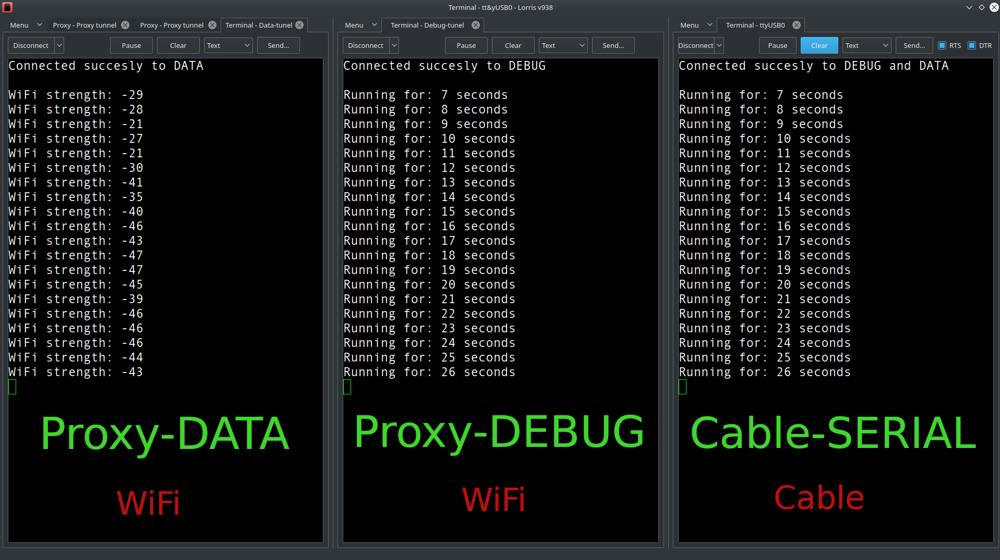

# Setup [Lorris](https://tasssadar.github.io/Lorris)
1. Go to [https://tasssadar.github.io/Lorris](https://tasssadar.github.io/Lorris)
 
   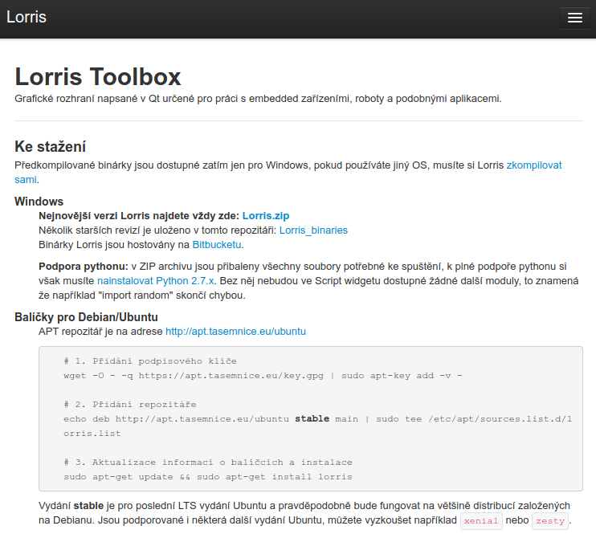
2. Download and install Lorris, open it
  
   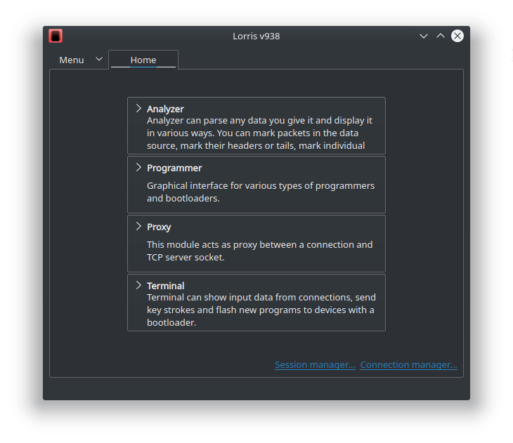
3. Clic to Proxy
   
    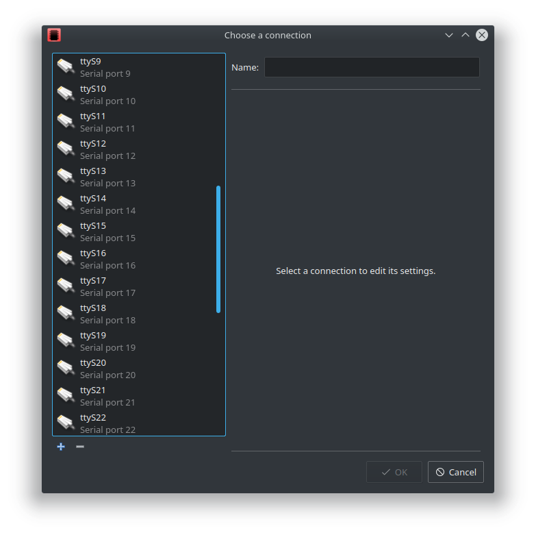
4. Click to `+` and `Add TCP client`

    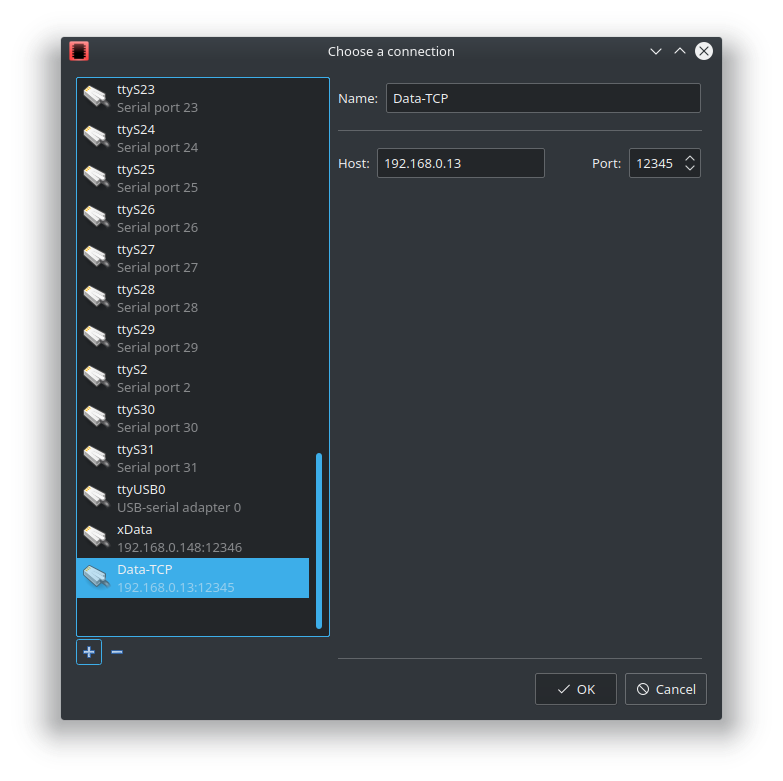
5. Set name, Host: YOUR_IP, and Port: 0-65535 for the TCP Data clinet

    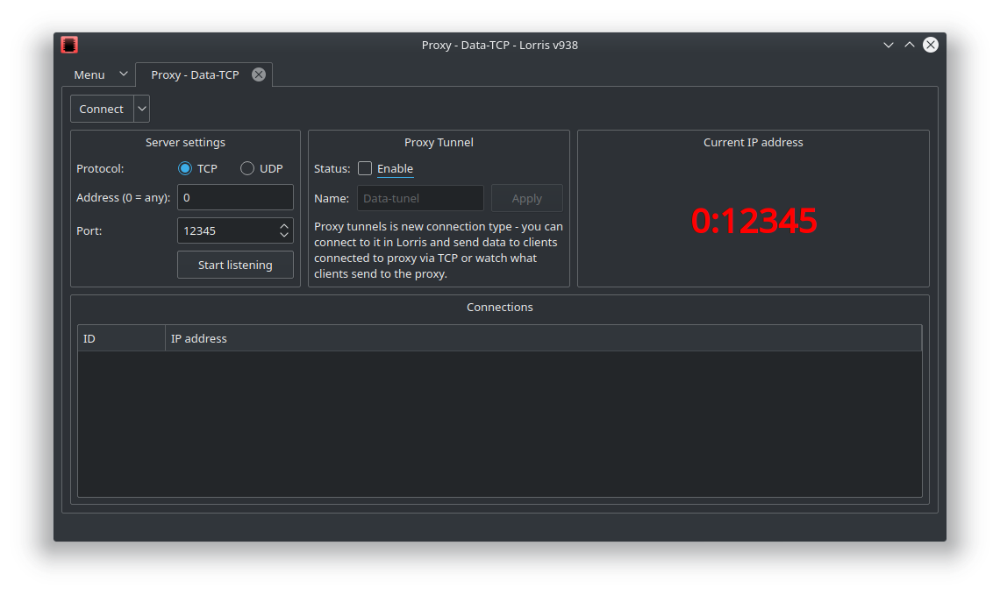
6. Clic to `Start listening`, enable Proxy tunel and then click to `Connect`

    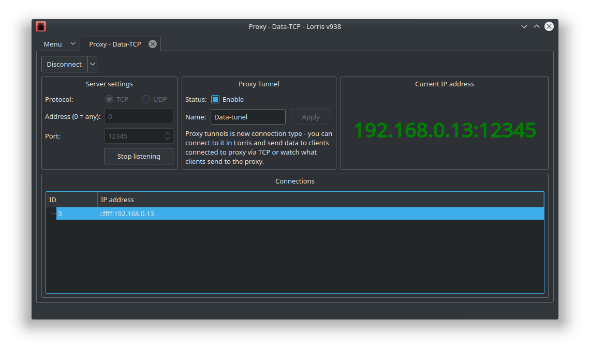
7. Data TCP is enabled
    
    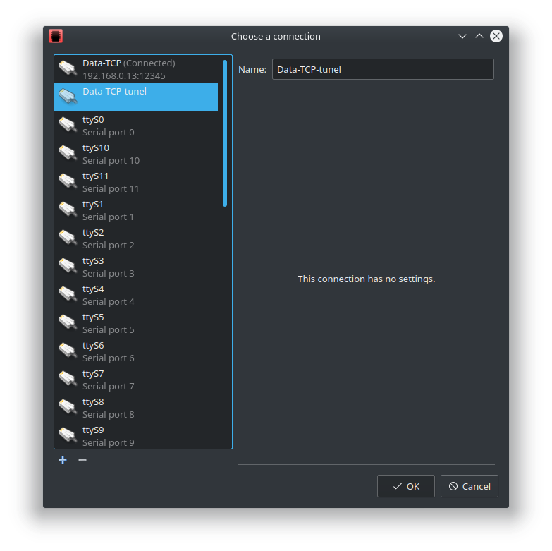
8. Then clic to `Menu` -> `File` -> `New` -> `Terminal` and chose Data Tunel
    
    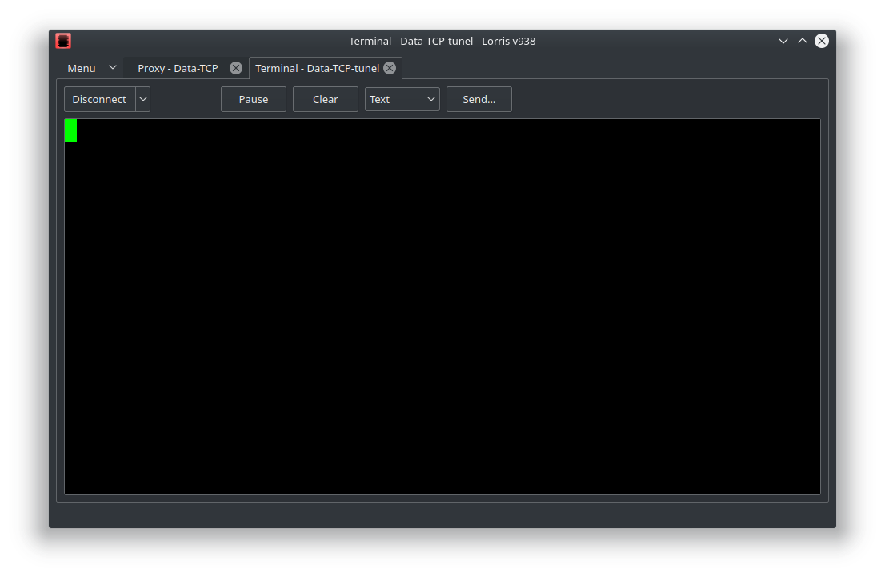
9. Now, you are connected to the Data tunel. Then clic to `Menu` -> `File` -> `New` -> `Proxy`
    
    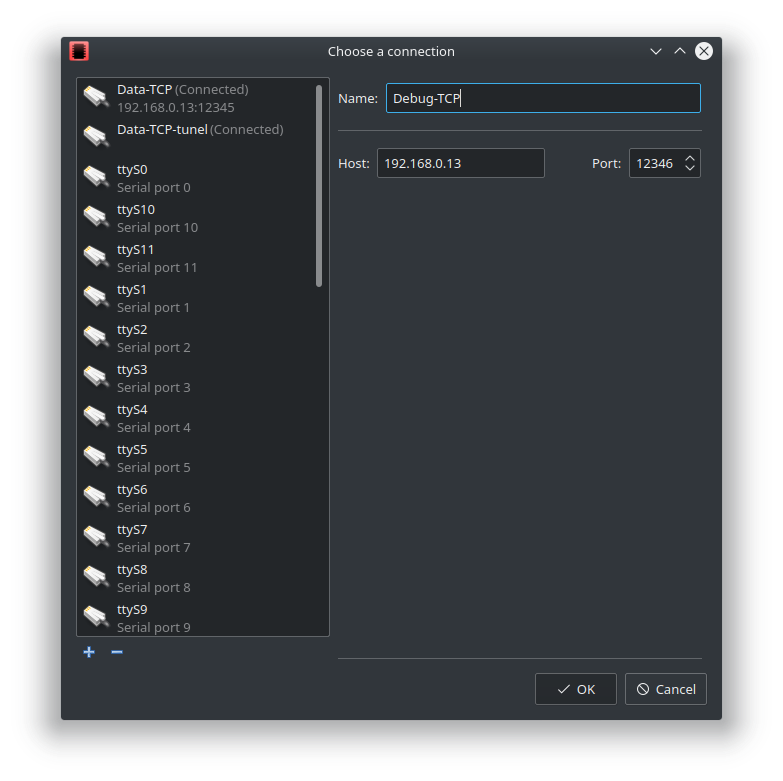
10. Set name, Host: YOUR_IP, and Port: 0-65535 for the TCP Debug clinet
    
    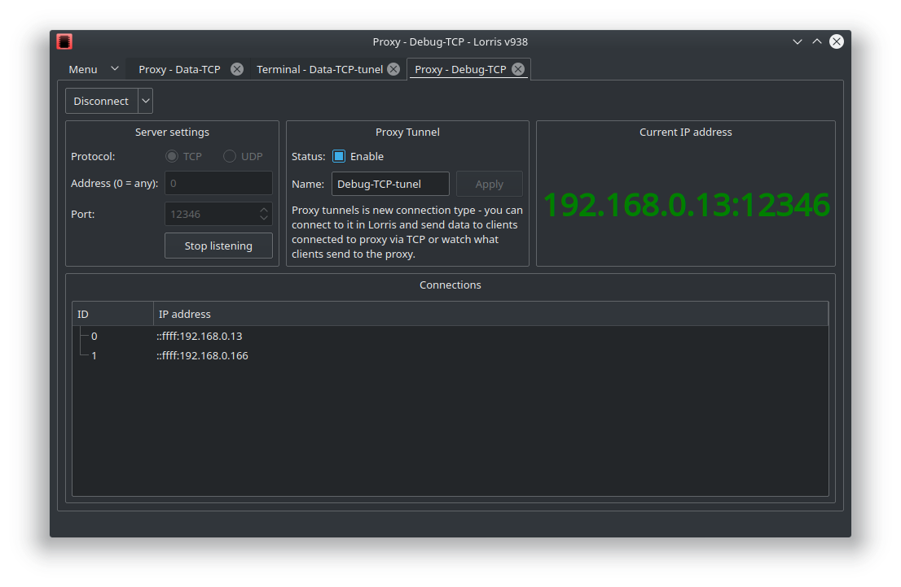
11. Clic to Start listening, enable Proxy tunel and then click to Connect
    
    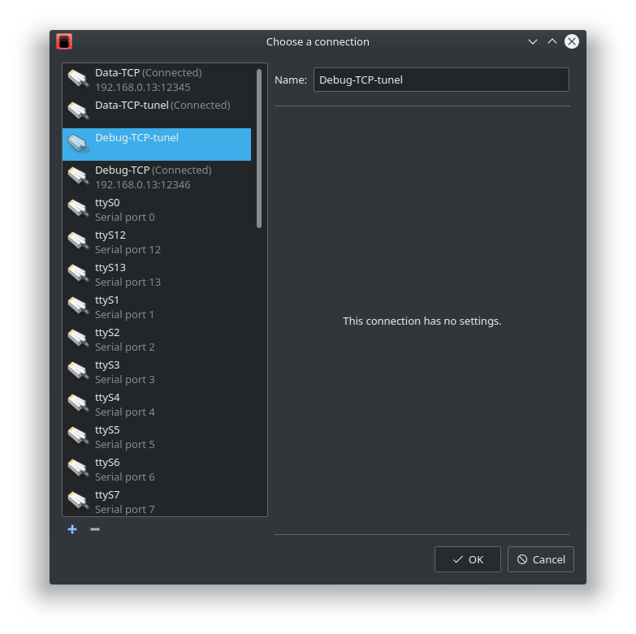
12. Then clic to `Menu` -> `File` -> `New` -> `Terminal` and chose Debug Tunel
    
    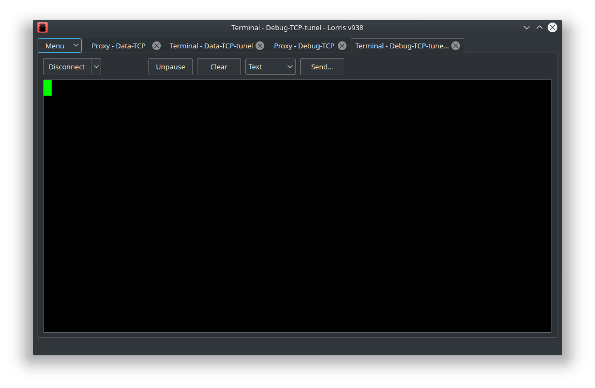
13. Now, you are connected to the Debug tunel.
    
    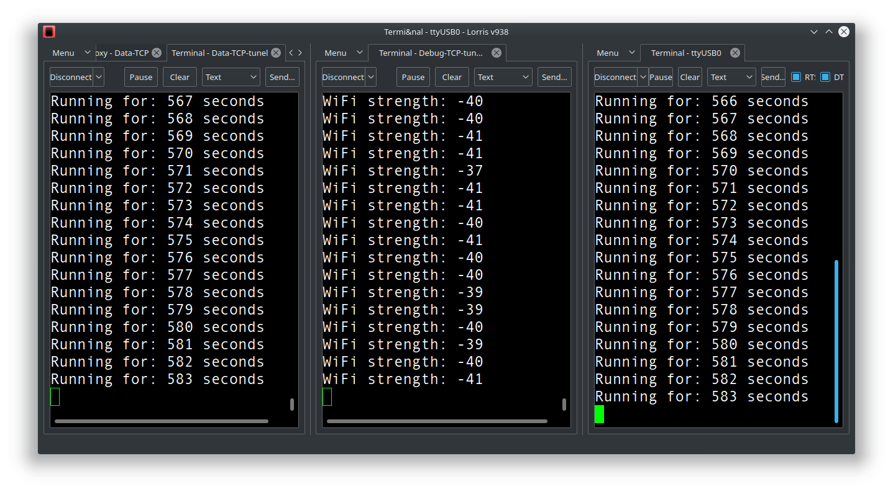
14. You can drag the table and split to sides (data, debug, serial)

# Setup software
1. Open `main.cpp` and edit connection settings 
 
    ```cpp
    // Setup connection
    #define SSID       "WiFi_SSID"
    #define PASSWORD   "WiFi_PASSWORD"
    static const IPAddress Debug_IP { 192, 168, 0, 13 };    //IP adress of your PC with Lorris
    static const uint16_t Debug_port = 12345;               //Proxy debug port
    static const uint16_t Data_port = 12346;                //Proxy data port
    ```
2.  Customize the programe
  
   ```cpp
    void loop() {
        int runtime = millis()/1000;

        Serial.println(String("Running for: " + String(runtime) + " seconds"));
        debug.println(String("Running for: " + String(runtime) + " seconds"));

        data.println(String("WiFi strength: " + String(WiFi.RSSI()) ));    
        
        delay(1000);

    }
   ```
3. Upload program to the ESP32
4. Have a fun :blush: